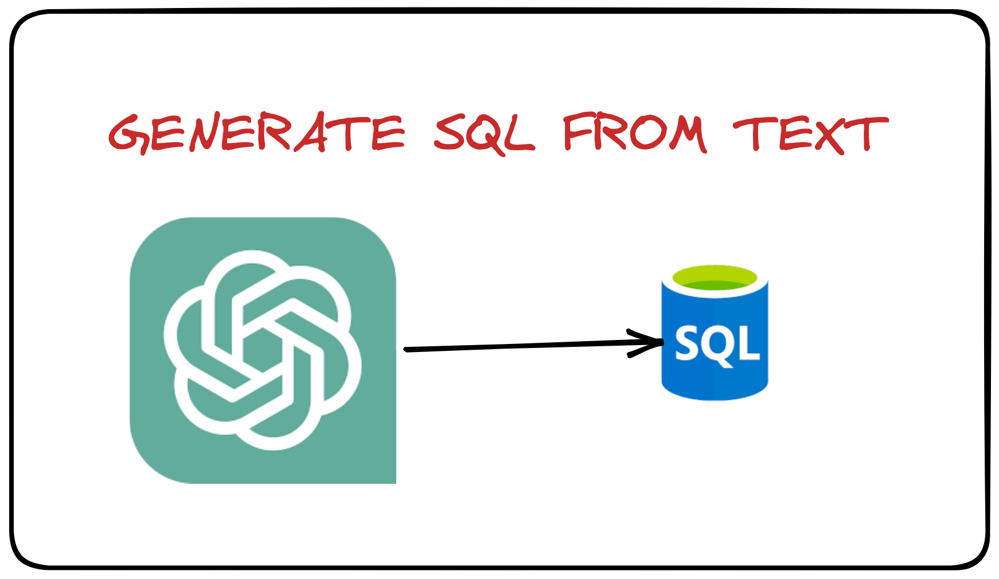

# Generating SQL From Natural Text using LLM Models

* Using OpenAI `gpt-3.5-turbo` to generate the code
* The Schema and data is downloaded from internet
* Used various OpenAI prompts to get the desired result
* Complex queries has some flaws that needs post processing